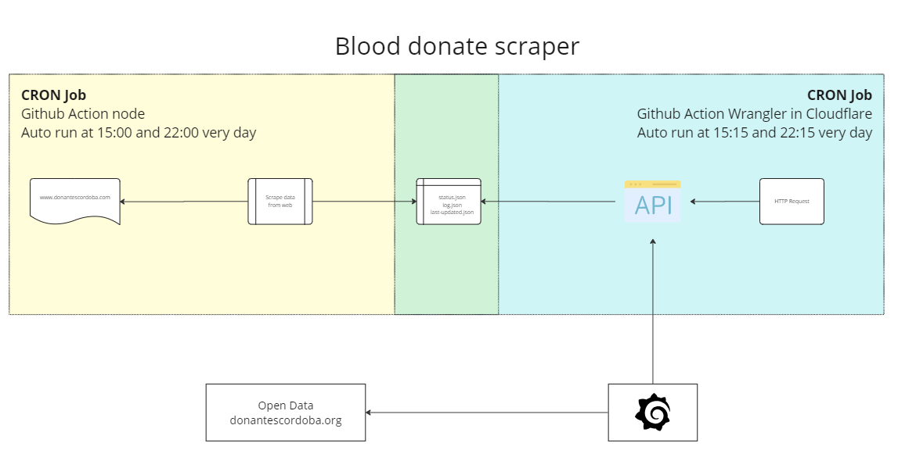

# Blood scraper

Desde la obtención de datos hasta pintado en Grafana


<template v-slot:icon>
  <div class="flex justify-center w-full h-full ">        
    <twemoji-drop-of-blood class="w-full h-full" /> 
  </div>  
</template>

<div class="pt-12">
  <span @click="next" class="px-2 p-1 rounded cursor-pointer hover:bg-white hover:bg-opacity-10">
    José María Santos
  </span>
</div>

---
layout: order-paper
---

<div class="grid grid-cols-4 gap-4 text-white mt-10">
  <OrderPaperItem icon="download" title="Datos" body="Recuperar los datos desde un html. Scrapping"/>
  <OrderPaperItem icon="api" title="Api" body="Crear una api con Holo que se ejecute en el Edge"/>
  <OrderPaperItem icon="timer" title="Cron Jobs" body="Github actions para ejcutar actualización y despligue de api"/>
  <OrderPaperItem icon="chartAreas" title="Grafana" body="Panel de control en Grafana para visualizar los datos"/>                    
</div>

---
layout: full
---
# Arquitectura



---
layout: center
class: "text-center"
---

# Obtener datos

http://www.donantescordoba.org/

---
layout: iframe

# the web page source
url: http://www.donantescordoba.org/
---


---

# Scraper

```ts {1|5-6|8|13-18|all} {lines:true}
import { load } from "cheerio";

const url = "http://www.donantescordoba.org";

const response = await fetch(url);
const body = await response.text();

let $ = load(body);

const $states = $("#block-block-16 img");
const states = [];

$states.each((index, el) => {
  const $el = $(el);
  if (index === 8) return;

  states.push($el.attr().title.trim());
});
```
---

# Scraper a base de datos

```ts {1|3|5|all} {lines:true}
const currentData = await readDBFile("blood-status");

const lastData = Array.from(currentData).concat({date: new Date().toISOString(), result})

await writeDBFile("blood-status", lastData);

await log('DB updated successfully');

function writeDBFile(dbName, data) {
  return writeFile(
    `${DB_PATH}/${dbName}.json`,
    JSON.stringify(data, null, 2),
    "utf-8"
  );
}
```
<div class="mt-5 text-center">
Ver en detalle en <a href="https://github.com/josemasf/blood-donate/blob/master/scraping/index.js">GitHub</a>
</div>

---

# API

```ts {3|5|7|all} {lines:true}
import status from "../db/blood-status.json";

import { Hono } from "hono";

const app = new Hono();

app.get("/status", (ctx) => ctx.json(status));

app.get("/last-status", (ctx) => {  
  const result = status.sort((a, b) => new Date(b.date) - new Date(a.date))[0];
  return ctx.json(result)
});

export default app;
```

<div class="mt-5 text-center">
Ver en detalle en <a href="https://github.com/josemasf/blood-donate/blob/master/src/index.js">GitHub</a>
</div>

---

# ¿Porqué Hono?

Hono - [炎] significa llama 🔥 en japonés - es un pequeño, simple y ultra rápido marco de trabajo web para los Edges. 

Funciona en cualquier entorno de ejecución de JavaScript: Cloudflare Workers, Fastly Compute@Edge, Deno, Bun, Vercel, Netlify, Lagon, AWS Lambda, Lambda@Edge y Node.js.

[Documentación](https://hono.dev/)

---

# ¿Qué es Edge Computing?

Edge computing o informática de perímetro es un modelo de computación que optimiza los dispositivos de Internet y las aplicaciones web acercando la informática al lugar donde se generan los datos. 

De esta manera, se minimiza la necesidad de establecer comunicaciones de larga distancia entre el cliente y el servidor, lo que reduce la latencia y el uso del ancho de banda.

---

# Despligue en Cloudfare

Con la ayuda de wrangler el cli de Cloudfare realizaremos el despligue de la API

Cloudflare Workers proporciona un entorno de ejecución sin servidor que te permite [crear nuevas aplicaciones](https://developers.cloudflare.com/workers/get-started/guide/) o mejorar las existentes sin configurar ni mantener infraestructura.

Cloudflare Workers se ejecuta en la red global de Cloudflare en cientos de ciudades de todo el mundo, ofreciendo planes tanto gratuitos como de pago.


---

# CRON Jobs

```yml 
name: Scrape donantescordoba Website

on:
  [...]
  schedule:
    - cron: "0 15,22 * * *"

jobs:
  build:
    runs-on: ubuntu-22.04
    steps:
      [...]
      - run: |
          npm run scrape
          git config user.name donantescordoba-bot
          git diff --quiet && git diff --staged --quiet || git commit -am "[bot] update donantescordoba database"
          git push origin master
```

<div class="mt-5 text-center">
Ver en detalle en <a href="https://github.com/josemasf/blood-donate/blob/master/.github/workflows/scrape-donantescordoba.yml">GitHub</a>
</div>

---

# API JSON en Grafana

- Añadir registrar el plugin.
- Añadir el data source.
- En la pestaña path añadir el recurso a cosumir.
- En fields indicar los campos a capturar.

<iframe width="100%" height="50%" src="https://www.youtube.com/embed/B4Uj1n4Cr88?si=Rzatz66HVaxvrAxl&amp;start=314" title="YouTube video player" frameborder="0" allow="accelerometer; autoplay; clipboard-write; encrypted-media; gyroscope; picture-in-picture; web-share" allowfullscreen></iframe>

---
layout: center
class: "text-center"
---

# Gracias
<div class="flex justify-center items-center gap-10">
  <div>
    <logos-linkedin-icon /> AIDA Canarias
  </div>
  <div>
    <logos-twitter /> @AIDASoftwate
  </div>
  <div>
    <logos-chrome /> aidacanarias.com
  </div>  
</div>

<Confetti class="top-50 relative" />